# 1-2-watch (When to Watch)
## Group Members: 
Yasin Hessnawi, Rami Amer

## Introduction

1.2.Watch, pronounced “When to Watch”, is a user-friendly application designed to help you keep track of all your favorite media—be it movies, series, or anime. With a friendly and intuitive interface, you’ll have all the information about your beloved media in one place. Know exactly when the next episode airs and where to watch it, if available. Find out when new movies are released or become available for streaming. Discover new and related content based on what you already love.

## Project Scope

### Watch is developed to:

	•	Enable users to track their favorite movies, series, and anime.
	•	Provide timely updates on new episodes and release dates.
	•	Inform users where to watch their favorite media.
	•	Offer personalized recommendations for related content.

### Target Audience

Our application is designed for anyone passionate about media. It targets users aged between 13 and 70 years old who have basic knowledge of using a smartphone.

### Core Functional Requirements

	1.	Media Information Access: Ability to see detailed information about any media.
	2.	Release Date Tracking: Ability to know the air dates of episodes or release dates of movies.

### Non-Functional Requirements

	1.	User-Friendly Interface: The app will be intuitive and easy to navigate.
	2.	Smooth Navigation: Smooth transition between app pages (scenes or screens).

### Optional Functional Requirements

	1.	Personalized Recommendations: Ability to see recommendations and related content related to your favorite media.
	2.	Community Content: Ability to view memes or fan art about the media.
	3.	Search Functionality: Ability to search for a media item.

### Optional Non-Functional Requirements

	1.	Device Compatibility: Support for most Android devices.
	2.	Performance: The app will be lightweight with a good response time.
	3.	Scalability and Maintainability: Ability to expand functionality and maintain the application over time.

## Technologies Used
- Programming Language: Kotlin
- IDE: Android Studio
- Architecture: MVVM (Model-View-ViewModel)
- Libraries and Tools:
- Retrofit (for networking)
- Gson (for JSON parsing)
- Glide (for image loading)
- Coroutines (for asynchronous operations)
- WorkManager (for background tasks)
- SharedPreferences (for local storage)
### APIs:
- TMDB (The Movie Database) API
- Kitsu API (for anime content)

## Installation
### Prerequisites
- Android Device: Running Android 5.0 (Lollipop) or higher.
- Internet Connection: Required for fetching media data.
### Steps
1. Download the APK

- The latest APK release can be downloaded from the Releases section of our GitHub repository.

2. Enable Installation from Unknown Sources

- On your Android device, go to Settings > Security. 
- Enable Unknown Sources to allow installation of apps from sources other than the Google Play Store. 

3. Install the Application

- Locate the downloaded APK file using a file manager. 
- Tap on the APK file and follow the on-screen instructions to install.

4. Launch the App

- After installation, open 1.2.Watch from your app drawer.
- Enjoy tracking and discovering your favorite media!

### Local Development
1. Clone the repository to your local machine using the following command:
```
git clone https://github.com/yasinhessnawi1/1-2-watch.git
```
2. Open the project in Android Studio.
3. Build and run the project on an Android emulator or physical device.
- Note: As this is a university project, the API keys for TMDB are included in the codebase in the constants file. 
For production use, it is recommended to obtain your own API keys (Its 100% free). As the key will be suspended after the project is graded.
4. Make changes to the codebase and test the application locally.

## Project Structure
### The project is structured as follows:

    •	`app` module: Contains the main application code.
    •	`models` package: Contains data models and repositories.
    •	`api` package: Contains network service and API calls.
    •	`ui` package: Contains the user interface components and view models.
    •	`utils` package: Contains utility classes and helper functions.
    •	`workers` package: Contains WorkManager classes for background tasks.
    •	`Repository` directory: Contains the repository classes for each media type.
    •	`Adapters` directory: Contains RecyclerView adapters for displaying media items.
    •	`res` directory: Contains resources such as layouts, strings, and drawables.
### Detailed project structure
#### Project structure
```
1.2.Watch/
├── app/
│   ├── Constants.kt
│   ├── adapters/
│   │   ├── MediaAdapter.kt
│   │   ├── DiscoverAdapter.kt
│   │   └── ProvidersAdapter.kt
│   ├── api/
│   │   ├── ApiClient.kt
│   │   └── ApiService.kt
│   ├── models/
│   │   ├── ProviderDetails.kt
│   │   ├── ApiResponses.kt
│   │   ├── MediaInfo.kt
│   │   ├── MediaType.kt
│   │   └── MediaDetails.kt
│   ├── repository/
│   │   ├── DetailsRepository.kt
│   │   ├── DiscoverRepository.kt
│   │   └── MediaRepository.kt
│   ├── ui/
│   │   ├── HomeActivity.kt
│   │   ├── DiscoverActivity.kt
│   │   ├── UserLikedActivity.kt
│   │   ├── DetailsActivity.kt
│   │   └── DiscoverViewModel.kt
│   ├── utils/
│   │   ├── Constants.kt
│   │   ├── NavigationUtils.kt
│   │   └── LikeButtonUtils.kt
│   └── workers/
│       ├── FetchMediaDetailsWorker.kt
│       ├── FetchPopularMediaWorker.kt
│       ├── FetchProvidersWorker.kt
│       ├── FetchSearchResultsWorker.kt
│       └── FetchRelatedItemsWorker.kt
├── res/
└── ...

```
#### Details 
- Explanation of Key Directories and Files
- app/: The main application directory containing all source code and resources.

- Constants.kt: Defines application-wide constants used throughout the project.

1. adapters/: Contains adapter classes responsible for binding data to RecyclerViews.

- MediaAdapter.kt: Binds media items to the home screen's RecyclerView.
- DiscoverAdapter.kt: Handles data binding for the Discover Activity's RecyclerView.
- ProvidersAdapter.kt: Manages the display of streaming providers in the UI.

2. api/: Manages API interactions and configurations.

- ApiClient.kt: Sets up the Retrofit client for network requests.
- ApiService.kt: Defines the API endpoints used to fetch media data.

3. models/: Contains data classes representing various entities within the app.

- ProviderDetails.kt: Represents details about streaming providers.
- ApiResponses.kt: Models for handling API responses.
- MediaInfo.kt: Basic information about media items.
- MediaType.kt: Enum class defining different types of media (e.g., Movie, Series, Anime).
- MediaDetails.kt: Detailed information about specific media items.

4. repository/: Handles data operations and abstracts data sources from the rest of the app.

- DetailsRepository.kt: Manages data fetching and processing for media details.
- DiscoverRepository.kt: Handles data related to media discovery features.
- MediaRepository.kt: General repository for managing media data interactions.

5. ui/: Contains all user interface components, including activities and view models.

- HomeActivity.kt: The main activity displaying trending media.
- DiscoverActivity.kt: Activity dedicated to discovering new media.
- UserLikedActivity.kt: Activity showing media items liked by the user.
- DetailsActivity.kt: Activity providing detailed information about a selected media item.
- DiscoverViewModel.kt: ViewModel for managing UI-related data in the Discover Activity.

6. utils/: Utility classes and helper functions.

- Constants.kt: Additional constants specific to utility functions.
- NavigationUtils.kt: Helper functions to facilitate navigation between activities.
- LikeButtonUtils.kt: Manages the state and functionality of like buttons within the app.

7. workers/: Background workers utilizing WorkManager for asynchronous tasks.

- FetchMediaDetailsWorker.kt: Worker to fetch detailed media information in the background.
- FetchPopularMediaWorker.kt: Worker responsible for fetching popular media data periodically.
- FetchProvidersWorker.kt: Worker to retrieve streaming provider information.
- FetchSearchResultsWorker.kt: Handles background fetching of search results.
- FetchRelatedItemsWorker.kt: Worker to fetch related media items based on user preferences. 
- build.gradle: Gradle build configuration file for managing project dependencies and build settings.


#### Additional Notes
- Modular Architecture: The project follows the MVVM (Model-View-ViewModel) architectural pattern, ensuring a clear separation of concerns. This modularity enhances maintainability and scalability, allowing for easy addition of new features and components.

- API Integration: Utilizing Retrofit and Gson facilitates seamless communication with TMDB and Kitsu APIs, enabling efficient data retrieval and parsing.

- Asynchronous Operations: Coroutines and WorkManager manage asynchronous tasks and background processing, ensuring a responsive and smooth user experience.

- User Experience Enhancements: Adapters and utility classes are designed for code reuse and consistency across different parts of the app, contributing to a cohesive and intuitive user interface.


## Competitors

Our main competitors include:

	•	IMDb
	•	JustWatch

## Our Contributions (Novelty)

While there are many applications providing media information, our focus is on helping you follow up with your favorite media by providing timely and specific information that’s not always easy to find. For instance, finding out when the next episode of your favorite show airs can be time-consuming if the media doesn’t have a straightforward schedule.

Our application aims to make this process seamless by allowing you to search for the name of the media and immediately get the information you’re looking for. We prioritize ease of use and straightforward access to information, making the experience of tracking your favorite media more enjoyable and less complex.

## Acknowledgments
- TMDB: For providing a comprehensive movie and TV show database.
- Kitsu: For supplying rich anime content.
- Open Source Libraries: Thanks to the developers of Retrofit, Gson, Glide, and other libraries used in this project.
- Placholder Images: Thanks to Unsplash for providing placeholder images for the app.
- Icons: Thanks to Flaticon for providing icons used in the app.
- Inspiration: Thanks to IMDb and JustWatch for inspiring the creation of this application.

## Usage

### Getting Started
#### Home Screen

- Upon launching the app, you'll be greeted with the Home Screen showcasing trending media.
- Scroll horizontally to browse through movies, TV shows, and anime.

#### Media Details

- Tap on any media item to view detailed information.
- Access summaries, release dates, cast information, and where to watch.

#### Tracking Media

- Use the Like Button to add media to your favorites.
- Your liked media will be saved for easy access in the User Liked Activity.

#### Search Functionality

- Tap on the Search Icon to open the search bar.
- Type the name of the media you're looking.

#### Personalized Recommendations

- Based on your liked media, the app will suggest related content you might enjoy.
- Find these recommendations on the Home Screen and in the Discover Activity.

### Step-by-Step Guide
1. Launch the App 


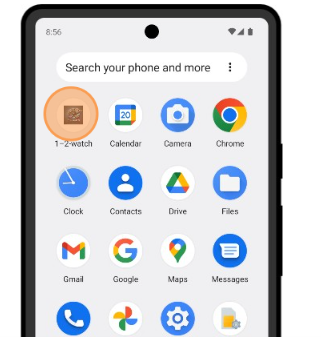

2. Home Screen
- horizontal scroll to view trending media 

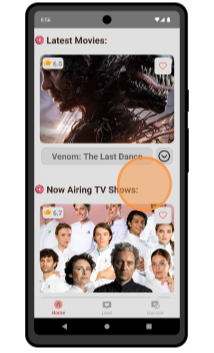

- Vertical scroll to view more media items 

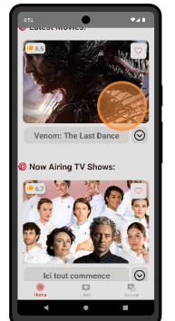 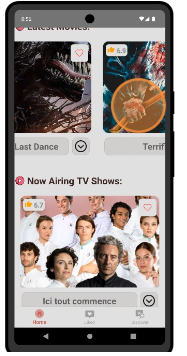

- Get extra details by tapping on the expand icon 

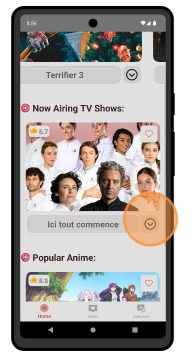 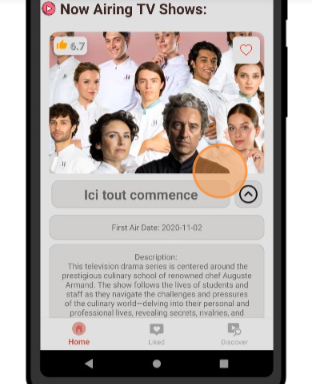

- Like media items to save them for later in the User Liked Activity (heart icon) 

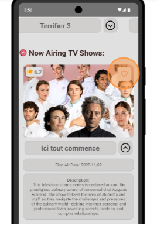 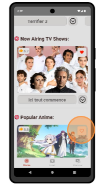 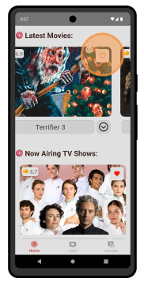

3. Liked Screen

- You can find your liked media in the User Liked Activity (bottom navigation bar) 

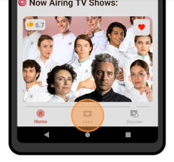 

- You can do as in home screen, scroll horizontally and vertically to view liked media items and 
get more details by the extend button (live data from the api will be shown)
- Like button will be disabled
- You can unlike the media item by tapping on the heart icon
- The expanded details defers from the home screen, it will show the media next release date if available
- You can go back by tapping on the back button in the top left corner

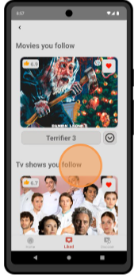 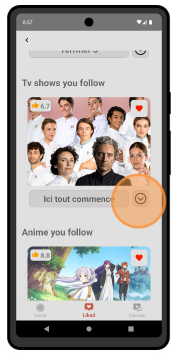 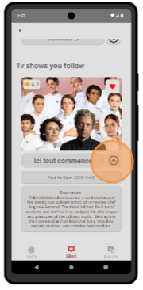

4. Discover Screen

- You can discover new media items in the Discover Activity (bottom navigation bar)

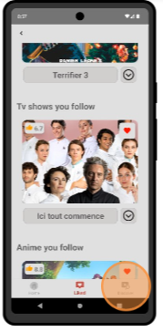

- Scroll horizontally to view different categories of media items , and vertically to view more media items

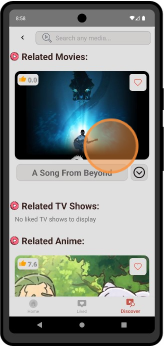 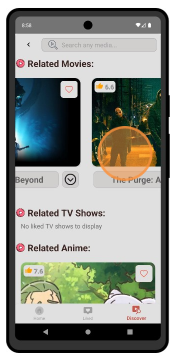
- Tap on the expand icon to get more details about the media item (same as in home screen)
- Like media items to save them for later in the User Liked Activity (heart icon)
- You can go back by tapping on the back button in the top left corner

- You can search for media items by tapping on the search icon in the top right corner

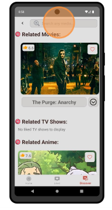 

- Type the name of the media item you're looking for and tap enter or wait one second to get the search results

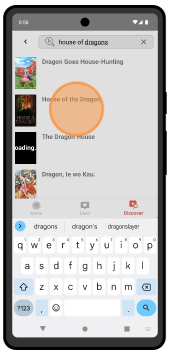


5. Details Screen

- You can get more details about a media item by tapping on the expand icon in the home screen, liked screen or discover screen
- The details screen will show you the media item details, dates, and where to watch
- You can like the media item by tapping on the heart icon
- You can unlike the media item by tapping on the heart icon
- You can go back by tapping on the back button in the top left corner

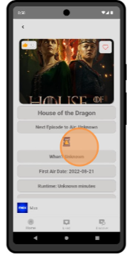


## Contact
- Yasin Hessnawi - yasinmh@stud.ntnu.no | https://github.com/yasinhessnawi1
- Rami Amer - Email | GitHub
